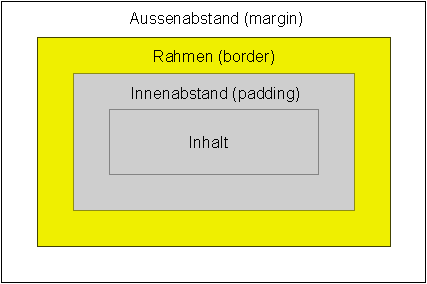

# CSS
Mit CSS kannst du das Aussehen (z.B. Hintergrundfarbe) deiner Seite verändern. Das Aussehen wird über CSS-Regeln bestimmt.  
CSS wird ein einer extra Datei geschrieben. Die Dateiendung ist immer .css.

- [CSS und HTML verbinden](#css-und-html-verbinden)
- [Klassen](#klassen)
- [CSS-Regeln](#css-regeln)
	- [Hintergrundfarbe](#hintergrundfarbe)
	- [Hintergrundbild](#hintergrundbild)
	- [Breite](#breite)
	- [Höhe](#höhe)
	- [Textausrichtung](#textausrichtung)
	- [Rahmen](#rahmen)
	- [Abstand](#abstand)
		- [Innen](#innen)
		- [Außen](#außen)
	- [Schrift](#schrift)
		- [Größe](#größe)
		- [Dicke](#dicke)
		- [Farbe](#farbe)
	- [Mausberührung](#mausberührung)


## CSS und HTML verbinden
Du musst in deiner HTML Datei sagen wo sie die CSS Datei finden kann. Das geht so:
```html
<head>
	<link rel="stylesheet" type="text/css" href="deineDatei.css">
</head>
```
Als Wert von `href` musst du den Namen deiner CSS Datei angeben.

## Klassen
Damit CSS das Aussehen eines Elements verändern kann, muss es das Element im HTML erkennen. Dafür werden Klassen benutzt. So gibst du einem HTML Element eine Klasse:
```html
<a class="deinKlassenName" href="https://www.hacker-school.de/">Hacker School</a>
```
Als Wert von `class` setzt du deinen Klassennamen, den du frei wählen kannst.  
In deiner CSS Datei kannst du deinen Klassennamen jetzt benutzen um das Aussehen von HTML Elementen mit dieser Klasse zu verändern.
 ```css
.deinKlassenName {
	...
}
```
Vor deinen Klassennamen kommt in CSS immer ein `.`. In den geschweiften Klammern gibst du mit CSS-Regeln an wie das Element mit dieser Klasse aussehen soll.

## CSS-Regeln
Mit CSS-Regeln bestimmst du wie deine HTML Elemente aussehen sollen. Mit ihnen kannst du zum Beispiel die Größe oder Hintergrundfarbe eines Elements ändern.  
CSS-Regeln bestehen immer aus zwei Teilen. Der Eigenschaft die du verändern möchtest und den Wert auf den du diese Eigenschaft setzen möchtest. Im folgenden Beispiel setzen wir die Schriftfarbe aller HTML Elemente mit der Klasse `headline` auf rot.
 ```css
.headline {
	color: red;
}
```
`color` ist in diesem Fall die Eigenschaft um die Farbe der Schrift zu bestimmen und `red` der Wert auf den wir sie setzen wollen.  
Du kannst einer Klasse so viele Regeln geben wie du möchtest. Wenn du zum Beispiel neben der Schriftfarbe auch die Breite aller HTML Elemente mit der Klasse `headline` setzen möchtest sieht das so aus:
 ```css
.headline {
	color: red;
	width: 500px;
}
```


### Hintergrundfarbe
Die Hintergrundfarbe änderst du mit `background-color`. Im folgenden Beispiel setzen wir die Hintergrundfarbe aller HTML Elemente mit der Klasse `link` auf blau:
```css
.link {
	background-color: blue;
}
```
Farben kannst du in CSS entweder mit ihren englischen Namen, zum Beispiel `blue` für blau oder `red` für rot, angeben, oder mit Zahlen die für bestimmte Farben stehen. Das obere Beispiel würde mit Zahlen so aussehen:
```css
.link {
	background-color: #0000ff;
}
```
Welche Farbe für welche Zahl steht kannst du über einen [Color Picker](https://htmlcolors.com/color-picker) herausfinden. Wichtig ist, dass du immer den Hexadezimal Wert der Farbe nimmst.

### Hintergrundbild
Du kannst auch ein Bild als Hintergrund setzen. Dafür lädst du dir das Bild herunter und speicherst es direkt neben deiner CSS Datei. So setzt du CSS das Bild als Hintergrund:
```css
.page {
	background-image: url("deinBild.jpg");
}
```
Statt `deinBild.jpg` gibst du den Namen des von dir heruntergeladenen Bilds mit Dateiendung (z.B. `.jpg`, `.gif` oder `.png`) an. Noch mehr Einstellungsmöglichkeiten zu Hintergrundbildern findest du [hier](https://www.w3schools.com/cssref/pr_background-image.asp).

### Breite
Die Breite eines HTML Elements änderst du so:
```css
.image {
	width: 500px;
}
```

### Höhe
Die Höhe eines HTML Elements änderst du so:
```css
.image {
	height: 400px;
}
```

### Textausrichtung
Als Standart sind Texte immer nach links ausgerichtet. Mit `text-align` bestimmst in welche Richtung dein Text ausgerichtet ist. Das folgende Beispiel richtet den Text nach rechts aus:
```css
.article {
	text-align: right;
}
```
Du kannst Texte mit `right` nacht rechts, `left` nach links und `justify ` als Block ausrichten.

### Rahmen
Mit `border` kannst du einem Element einen Rahmen geben. Im folgenden Beispiel wird ein 2 Pixel breiter, durchgezogener, schwarzer Rahmen gesetzt:
 ```css
.box {
	border: 2px solid black;
}
```
Als erster Wert wird die dicke des Rahmens gesetzt.  
Der zweite Wert bestimmt wie der Rahmen aussehen soll, in unserem Beispiel durchgezogen. Möglich wäre auch ein gepunkteter oder gestrichelter Rahmen.  
Der letzte Wert bestimmt die Farbe des Rahmens. Diese kann wie die [Hintergrundfarbe](#hintergrundfarbe) als englisches Wort oder als Zahl angegeben werden.  
Der Rahmen kann auch nur in eine Richtung gesetzt werden. Das folgende Beispiel setzt nur oben einen Rahmen:
```css
.box {
	border-top: 3px dotted #3A8F5B;
}
```
Mit `border-top` setzt du oben einen Rahmen, mit `border-right` rechts, mit `border-bottom` unten und mit `border-left` links.  
Noch mehr Einstellungsmöglichkeiten zu Rahmen findest du [hier](https://www.w3schools.com/css/css_border.asp).

### Abstand
Du kannst den Außen- und Innenabstand eines HTML Elements setzen. Um den Unterschied zu verstehen, musst du wissen wie HTML Elemente aufgebaut sind. Sie bestehen aus Inhalt, Innenabstand, Rahmen und Außenabstand.  

#### Innen
Mit `padding` setzt du den Innenabstand eines Elements. Im folgenden Beispiel wird der Innenabstand in alle Richtungen auf 8 Pixel gesetzt:
```css
.article {
	padding: 8px;
}
```
Du kannst den Innenabstand auch nur in eine Richtung setzen. Zum Beispiel nur nach oben:
```css
.article {
	padding-top: 16px;
}
```
Mit `padding-top` setzt du den Innenabstand nach oben, mit `padding-right` nach rechts, mit `padding-bottom` nach unten und mit `padding-left` nach links.
#### Außen
Mit `margin` setzt du den Außenabstand eines Elements. Im folgenden Beispiel wird der Außenabstand in alle Richtungen auf 8 Pixel gesetzt:
```css
.article {
	margin: 8px;
}
```
Du kannst den Ausßenabstand auch nur in eine Richtung setzen. Zum Beispiel nur nach oben:
```css
.article {
	margin-top: 16px;
}
```
Mit `margin-top` setzt du den Außenabstand nach oben, mit `margin-right` nach rechts, mit `margin-bottom` nach unten und mit `margin-left` nach links.

### Schrift
Für die Schrift auf deiner Seite kannst du die Größe, Farbe und Dicke einstellen.
#### Größe
Die Schriftgröße änderst du mit `font-size`. So setzt du zum Beispiel die Schriftgröße auf 30 Pixel:
```css
.box {
	font-size: 30px;
}
```
#### Dicke
Die Schriftdicke änderst du mit `font-weight`. So setzt du zum Beispiel die Dicke auf fett:
```css
.box {
	font-weight: bold;
}
```
Mit `bold` setzt du die Schriftdicke auf fett und mit `lighter` auf dünn. Du kannst die Schriftdicke auch mit einer Zahl zwischen 100 und 900 setzen. Dabei sind nur hunderter Schritte möglich. Du kannst also 100, 200, 300, 400, 500, 600, 700, 800 oder 900 angeben.
#### Farbe
Die Schriftfarbe änderst du mit `color`. So setzt du zum Beispiel die Farbe auf grün:
```css
.box {
	color: green;
}
```
Du kannst die Schriftfarbe genauso wie die [Hintergrundfarbe](#hintergrundfarbe) als englisches Wort oder als Zahl angegeben.

### Mausberührung
Du kannst ein Element anders aussehen lassen, wenn du es mit der Maus berührst bzw. darüber fährst. Das machst du mit `:hover`. Im folgenden Beispiel wird die Hintergrundfarbe aller Elemente mit der Klasse `touch` geändert, wenn sie mit der Maus berührt werden:
```css
.touch:hover {
	background-color: green;
}
```
